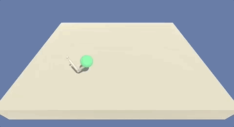

# Continuous Control with Deep Reinforcement Learning

This project contains an agent based on **Deep Reinforcement Learning** that can learn from zero (no labeled data) to control a double-jointed arm to reach a ball.

It's use the [Unity Machine Learning Agents Toolkit](https://github.com/Unity-Technologies/ml-agents) to design, train, and evaluate deep reinforcement learning algorithms implementations.

The environment used for this project is the Udacity version of the [Reacher Environment](https://github.com/Unity-Technologies/ml-agents/blob/master/docs/Learning-Environment-Examples.md#reacher), from [Unity](https://unity3d.com/pt/machine-learning).

We have two versions for this Unity environment:

#### Version 1: One (1) Agent



#### Version 2: Twenty (20) Agents


This project is part of my [Deep Reinforcement Learning Nanodegree](https://www.udacity.com/course/deep-reinforcement-learning-nanodegree--nd893).

## Environment details

In this environment, a double-jointed arm can move to target locations.

The first version contains a single agent.

The second version contains 20 identical agents, each with its own copy of the environment.

### Reward

A reward of +0.1 is provided for each step that the agent's hand is in the goal location. Thus, the goal of your agent is to maintain its position at the target location for as many time steps as possible.

### State and Action spaces

The observation **space** consists of 33 variables corresponding to position, rotation, velocity, and angular velocities of the arm.

Each **action** is a vector with four numbers, corresponding to torque applicable to two joints. Every entry in the **action** vector should be a number between -1 and 1.

### Solving the Environment

#### Option 1: Solve the First Version

The task is episodic, and in order to solve the environment, your agent must get an average score of +30 over 100 consecutive episodes.

#### Option 2: Solve the Second Version

The barrier for solving the second version of the environment is slightly different, to take into account the presence of many agents. In particular, your agents must get an average score of +30 (over 100 consecutive episodes, and over all agents). Specifically,

After each episode, we add up the rewards that each agent received (without discounting), to get a score for each agent. This yields 20 (potentially different) scores. We then take the average of these 20 scores.

This yields an average score for each episode (where the average is over all 20 agents).

The environment is considered solved, when the average (over 100 episodes) of those average scores is at least +30.

---

## Installation

The installation process is divided in three parts:

1. Python 3.6.x
2. Dependencies
3. Unity's Environment


This notebook was developed on AWS SageMaker.

The kernel used is **conda_python3**


### Python

To install and run this project you will need to have Python 3.6.x.

You could download olds Anaconda versions [here](https://repo.anaconda.com/archive/)

The reason for it is that Unity ml-agents needs TensorFlow in version 1.15 and TensorFlow 1.15 needs Python. 3.6.x.

The best way to run this project is on [AWS SageMaker](https://aws.amazon.com/pt/sagemaker/).

### Dependencies 

All packages and their versions are describe in [requirements.txt](requirements.txt).

You need to run these commands before to install all dependencies:

```
pip install --upgrade pip
pip install -r requirements.txt
pip -q install ./python
```

You'll have these three commands in the first part of [Continuous_Control.ipynb], as well.

### Unity's Environment

As you know, we have two different environment versions for this project. Select what you want.

The environment for **Linux** and **Windows (64-bit)** is already in that repository.

Download the environment from one of the links below.  You need only select the environment that matches your operating system:

- **Version 1: One (1) Agent**
 - Linux: [click here](https://s3-us-west-1.amazonaws.com/udacity-drlnd/P2/Reacher/one_agent/Reacher_Linux.zip)
 - Mac OSX: [click here](https://s3-us-west-1.amazonaws.com/udacity-drlnd/P2/Reacher/one_agent/Reacher.app.zip)
 - Windows (32-bit): [click here](https://s3-us-west-1.amazonaws.com/udacity-drlnd/P2/Reacher/one_agent/Reacher_Windows_x86.zip)
 - Windows (64-bit): [click here](https://s3-us-west-1.amazonaws.com/udacity-drlnd/P2/Reacher/one_agent/Reacher_Windows_x86_64.zip)

- **Version 2: Twenty (20) Agents**
 - Linux: [click here](https://s3-us-west-1.amazonaws.com/udacity-drlnd/P2/Reacher/Reacher_Linux.zip)
 - Mac OSX: [click here](https://s3-us-west-1.amazonaws.com/udacity-drlnd/P2/Reacher/Reacher.app.zip)
 - Windows (32-bit): [click here](https://s3-us-west-1.amazonaws.com/udacity-drlnd/P2/Reacher/Reacher_Windows_x86.zip)
 - Windows (64-bit): [click here](https://s3-us-west-1.amazonaws.com/udacity-drlnd/P2/Reacher/Reacher_Windows_x86_64.zip)

(_For Windows users_) Check out [this link](https://support.microsoft.com/en-us/help/827218/how-to-determine-whether-a-computer-is-running-a-32-bit-version-or-64) if you need help with determining if your computer is running a 32-bit version or 64-bit version of the Windows operating system.

(_For AWS_) If you'd like to train the agent on AWS (and have not [enabled a virtual screen](https://github.com/Unity-Technologies/ml-agents/blob/master/docs/Training-on-Amazon-Web-Service.md)), then please use [this link](https://s3-us-west-1.amazonaws.com/udacity-drlnd/P2/Reacher/one_agent/Reacher_Linux_NoVis.zip) (version 1) or [this link](https://s3-us-west-1.amazonaws.com/udacity-drlnd/P2/Reacher/Reacher_Linux_NoVis.zip) (version 2) to obtain the "headless" version of the environment.  You will **not** be able to watch the agent without enabling a virtual screen, but you will be able to train the agent.  (_To watch the agent, you should follow the instructions to [enable a virtual screen](https://github.com/Unity-Technologies/ml-agents/blob/master/docs/Training-on-Amazon-Web-Service.md), and then download the environment for the **Linux** operating system above._)
    
Then, place the unzipped folder on the root of this repository.

---

## License

The contents of this repository are covered under the MIT [License](LICENSE).